# MYGA Learning — School Management Platform

A private school-management platform that lets **parents follow their children's
academic life remotely** — grades, attendance, teacher feedback and school
announcements — instead of having to visit the school in person. Teachers manage
the academic information for the classes and subjects they are assigned to, and
administrators manage the whole academic structure and user access.

> **End-of-Study Project (PFE).** This repository started as a small Spring Boot
> CRUD prototype (Parent / Student / Classe) and has been grown incrementally
> into a layered, secured, tested platform with an Angular front end.

---

## Table of contents

- [Business problem](#business-problem)
- [User roles](#user-roles)
- [Main features](#main-features)
- [Architecture](#architecture)
- [Tech stack](#tech-stack)
- [Database model](#database-model)
- [Authentication & authorization](#authentication--authorization)
- [Running the backend](#running-the-backend)
- [Running the frontend](#running-the-frontend)
- [Environment configuration](#environment-configuration)
- [API reference](#api-reference)
- [Testing](#testing)
- [Screenshots](#screenshots)
- [Future improvements](#future-improvements)
- [Project layout](#project-layout)

---

## Business problem

Parents often have to travel to the school just to hear how their child is doing.
MYGA Learning moves that information online, securely:

- Parents see their **own** children's grades, attendance, teacher feedback and
  the announcements that concern them — and nothing about other families.
- Teachers record grades, attendance and observations, but only for the classes
  and subjects they are actually assigned to.
- Administrators run the academic structure (users, classes, subjects, academic
  staff) and publish announcements.

**Students are academic entities, not users** — they never log in. Only admins,
teachers and parents authenticate, and **all accounts are created by the
administration** (there is no public sign-up).

## User roles

| Role | Can do |
|------|--------|
| **ADMIN** | Manage users (teachers, parents), students, classes, subjects; assign teachers to classes/subjects; link parents to their children; publish announcements; read everything. |
| **TEACHER** | See their assigned classes/subjects; record grades, attendance and observations **only** for students in those classes. |
| **PARENT** | Read-only access to **their own** children: profile, grades, attendance summary, teacher feedback; receive announcements and notifications. |

There is deliberately **no `STUDENT` role**.

## Main features

- 🔐 **JWT authentication** with BCrypt-hashed passwords and role-based access control.
- 🧑‍🎓 **Academic structure**: students, classes, subjects, teachers, parents.
- 📝 **Grades**: teachers record grades for their subjects/classes; parents view their child's grades.
- 🗓️ **Attendance**: mark a whole class in one request (PRESENT / ABSENT / LATE / EXCUSED); per-student summary with an attendance percentage.
- 🗒️ **Teacher observations** with a **parent-visibility flag** (feedback shared with parents vs. private internal notes).
- 📢 **Announcements** targeted to everyone, all parents, all teachers, a specific class, or a single user.
- 🔔 **In-app notifications** generated on real events — a new grade, a new absence, a new visible observation, a new announcement — with per-user unread counts and mark-as-read.
- 🛡️ **Server-side ownership enforcement (IDOR protection)**: a client-supplied `studentId` is always checked against the caller's own relationships; a parent cannot read another family's data and a teacher cannot act outside their assignments — even by editing an id.
- 🧪 **Assessments** (exam / quiz / homework / project / oral) tied to **academic years and semesters**; a grade linked to an assessment inherits its subject, maximum grade and semester.
- 📈 **Performance**: subject and semester averages plus an improving/stable/declining trend, computed only from stored grades.
- 📊 **Role dashboards** with real aggregates (totals, recent activity, upcoming assessments, attendance %).
- 🔎 **Pagination and filtering** on the student listing and the staff grade search.
- 👤 **Account administration**: list users, and enable/disable a login without deleting it.
- 🖥️ **Angular front end**: login and role-based dashboards, admin management
  screens, the teacher workspace (attendance, grades, assessments, observations),
  the parent portal, notifications and announcements — behind a JWT HTTP
  interceptor and route guards.

## Architecture

Clean, layered backend with DTO boundaries — JPA entities are never exposed
directly by the API:

```
Angular SPA  ──HTTP (JWT Bearer)──▶  Controller ──▶ Service ──▶ Repository ──▶ H2 (dev) / PostgreSQL
                                        │             │
                                     DTOs +        business rules +
                                     validation    ownership checks
```

- **Controllers** handle HTTP, validation (`@Valid`) and status codes only.
- **Services** hold business logic, transactions and **authorization/ownership**.
- **Mappers** convert entities ⇄ request/response DTOs.
- A `@RestControllerAdvice` turns exceptions into a consistent JSON error body
  (400 validation, 401 auth, 403 forbidden, 404 not found).
- A stateless **JWT filter** authenticates each request; an entry point returns
  JSON `401`s.

## Tech stack

**Backend** (verified, actually used in the repo)

- Java 11, Spring Boot 2.6.4
- Spring Web, Spring Data JPA / Hibernate
- Spring Security 5 + JWT (`io.jsonwebtoken` 0.11.5), BCrypt
- Bean Validation (Hibernate Validator)
- H2 in-memory database (development) · PostgreSQL via the `postgres` profile
- springdoc-openapi (Swagger UI)
- Lombok, Maven
- JUnit 5, Spring Boot Test, Spring Security Test

**Frontend**

- Angular 19 (standalone components, signals), TypeScript, RxJS
- Angular Router with route guards, functional HTTP interceptor, Reactive Forms

> H2 is the default for local development. A `postgres` profile is provided
> for a persistent database — see [Environment configuration](#environment-configuration).

## Database model

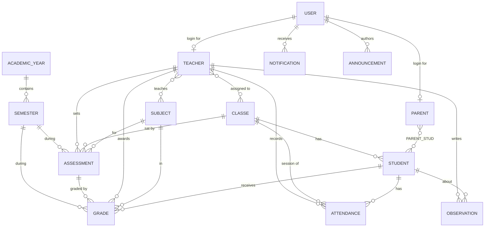

Core entities: `User` (+ `Role`), `Student`, `Parent`, `Classe`, `Teacher`,
`Subject`, `Grade`, `Attendance` (+ `AttendanceStatus`), `TeacherObservation`
(+ `ObservationType`), `Assessment` (+ `AssessmentType`), `AcademicYear`,
`Semester`, `Announcement` (+ `AnnouncementTarget`), `Notification`
(+ `NotificationType`).

The academic year of a grade or assessment is always **derived from its
semester**, so the two can never disagree.

## Authentication & authorization

- `POST /api/auth/login` with `{ email, password }` returns a signed **JWT**
  plus the user's identity and role.
- Send it on every protected request: `Authorization: Bearer <token>`.
- Passwords are stored **BCrypt-hashed**; the login error is deliberately
  generic (no account enumeration).
- Authorization is enforced **in the backend**, not just in Angular guards:
  - Writes are `ADMIN`-only, except grades/attendance/observations which
    `ADMIN` **or** an assigned `TEACHER` may create.
  - Sensitive reads (a student's grades/attendance/observations) run an
    **ownership check** in the service layer.

A default administrator is **seeded on first start** if no admin exists (see
[Environment configuration](#environment-configuration)):

```
email:    admin@myga.local
password: admin123      # development default — change it for any real use
```

## Running the backend

Requirements: JDK 11+ and Maven (the Maven wrapper is included).

```bash
cd backend
./mvnw spring-boot:run
```

- API base URL: `http://localhost:8080/api`
- **Swagger UI: `http://localhost:8080/swagger-ui.html`** (OpenAPI spec at `/v3/api-docs`)
- H2 console: `http://localhost:8080/h2-console` (JDBC URL `jdbc:h2:mem:myga`)

To run against PostgreSQL instead of H2:

```bash
./mvnw spring-boot:run -Dspring-boot.run.profiles=postgres
```

Quick smoke test:

```bash
# Log in as the seeded admin
curl -s -X POST http://localhost:8080/api/auth/login \
  -H 'Content-Type: application/json' \
  -d '{"email":"admin@myga.local","password":"admin123"}'
```

## Running the frontend

Requirements: Node.js 18+ (developed on Node 22) and npm.

```bash
cd frontend
npm install
npm start          # http://localhost:4200
```

The backend already allows the `http://localhost:4200` origin (CORS). Log in
with the seeded admin credentials above; you'll be routed to the dashboard for
your role.

### Demo data

A fresh database contains only the default administrator. To fill it with the
school used in the [screenshots](#screenshots) — classes, subjects, teachers,
students, parent accounts, assessments, grades, attendance, feedback and
announcements — run, against a freshly started backend:

```bash
node docs/seed-demo-data.js
```

It logs in as the administrator and then as a teacher and drives the public REST
API only, so it also works as an end-to-end smoke test. It creates the logins
`turing@myga.local` / `teacher123` (teacher) and `pierre@myga.local` /
`parent123` (parent) — local development credentials, not for any real
deployment.

## Environment configuration

**Backend** — `backend/src/main/resources/application.properties`, overridable
via environment variables:

| Variable | Default | Purpose |
|----------|---------|---------|
| `JWT_SECRET` | dev placeholder (≥ 32 bytes) | JWT signing key |
| `jwt.expiration-ms` | `86400000` (24h) | Token lifetime |
| `APP_ADMIN_EMAIL` | `admin@myga.local` | Seeded admin email |
| `APP_ADMIN_PASSWORD` | `admin123` | Seeded admin password |

**PostgreSQL profile** (`postgres`) — `backend/src/main/resources/application-postgres.properties`:

| Variable | Default | Purpose |
|----------|---------|---------|
| `DB_URL` | `jdbc:postgresql://localhost:5432/myga` | JDBC URL |
| `DB_USERNAME` | `myga` | Database user |
| `DB_PASSWORD` | `myga` | Database password |

The profile only overrides the datastore (and switches `ddl-auto` to `update`
so the schema survives restarts) — no application code differs between H2 and
PostgreSQL.

**Frontend** — `frontend/src/environments/environment.ts` sets `apiUrl`
(defaults to `http://localhost:8080/api`).

## API reference

The full, always-current reference is the **Swagger UI at
`http://localhost:8080/swagger-ui.html`** — paste a token from
`POST /api/auth/login` into *Authorize* to try the secured endpoints.

The summary below lists the main routes. All paths are prefixed with `/api`.
🔒 = requires a Bearer token.

### Auth
| Method | Path | Access | Description |
|--------|------|--------|-------------|
| POST | `/auth/login` | public | Authenticate, returns a JWT + user info |

### Students · Parents · Classes · Subjects · Teachers
| Method | Path | Access | Description |
|--------|------|--------|-------------|
| GET | `/students`, `/students/{id}` | 🔒 any role | List / get students |
| POST/PUT/DELETE | `/students`, `/students/{id}` | 🔒 ADMIN | Manage students |
| GET | `/parents`, `/parents/{phone}` | 🔒 any role | List / get parents |
| POST/PUT/DELETE | `/parents`, `/parents/{phone}` | 🔒 ADMIN | Manage parents (optionally provision a login) |
| POST | `/parents/{phone}/students/{studentId}` | 🔒 ADMIN | Link a child to a parent |
| GET | `/classes`, `/classes/{id}` | 🔒 any role | List / get classes |
| POST | `/classes` | 🔒 ADMIN | Create a class |
| GET | `/subjects`, `/subjects/{id}` | 🔒 any role | List / get subjects |
| POST | `/subjects` | 🔒 ADMIN | Create a subject |
| GET | `/teachers`, `/teachers/{id}` | 🔒 any role | List / get teachers |
| POST | `/teachers` | 🔒 ADMIN | Create a teacher **and** their login |
| POST | `/teachers/{id}/subjects/{subjectId}` | 🔒 ADMIN | Assign a subject |
| POST | `/teachers/{id}/classes/{classeId}` | 🔒 ADMIN | Assign a class |

### Grades · Attendance · Observations
| Method | Path | Access | Description |
|--------|------|--------|-------------|
| POST | `/grades` | 🔒 ADMIN or assigned TEACHER | Record a grade |
| GET | `/students/{id}/grades` | 🔒 ownership | A student's grades |
| POST | `/attendance` | 🔒 ADMIN or assigned TEACHER | Record one attendance entry |
| POST | `/attendance/bulk` | 🔒 ADMIN or assigned TEACHER | Mark a whole class at once |
| GET | `/students/{id}/attendance` | 🔒 ownership | Attendance records + summary |
| POST | `/observations` | 🔒 ADMIN or assigned TEACHER | Record an observation |
| GET | `/students/{id}/observations` | 🔒 ownership + visibility | Observations (parents see visible only) |

### Announcements · Notifications · Portals
| Method | Path | Access | Description |
|--------|------|--------|-------------|
| POST | `/announcements` | 🔒 ADMIN | Publish an announcement |
| GET | `/announcements` | 🔒 ADMIN | All announcements |
| GET | `/announcements/me` | 🔒 any role | Announcements relevant to me |
| GET | `/notifications/me` | 🔒 any role | My notifications |
| GET | `/notifications/me/unread-count` | 🔒 any role | My unread count |
| PUT | `/notifications/{id}/read` | 🔒 recipient | Mark one read |
| PUT | `/notifications/me/read-all` | 🔒 any role | Mark all read |
| GET | `/parent/me/children` | 🔒 PARENT | My children |
| GET | `/teacher/me/classes`, `/teacher/me/subjects` | 🔒 TEACHER | My assignments |

**"Ownership"** means the service verifies the student belongs to the caller
(a parent's own child, or a student in the teacher's assigned class); admins are
unrestricted.

## Testing

```bash
cd backend
./mvnw test
```

The suite prioritises security and business logic — authentication, role
authorization, parent-child and teacher-assignment ownership (IDOR attempts),
grade/attendance/observation creation rules, and announcement/notification
fan-out.

## Screenshots

Real captures of the running application — the Angular front end talking to the
Spring Boot API. The data comes from
[`docs/seed-demo-data.js`](docs/seed-demo-data.js), which builds the whole demo
school through the public REST API, so every screen below can be reproduced
locally.

### Signing in

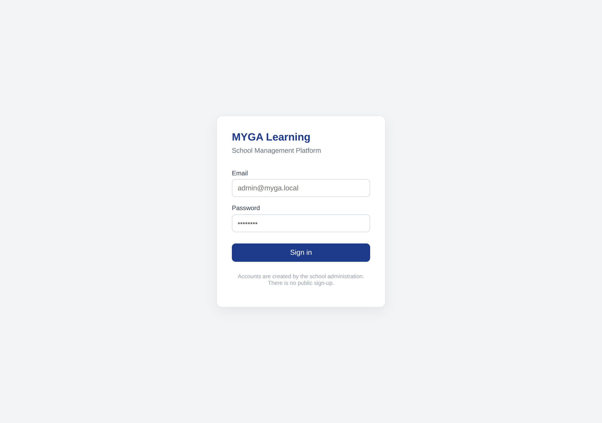

Only administrators, teachers and parents authenticate — accounts are created by
the administration, there is no public sign-up, and **students never get an
account**. Wrong credentials return a deliberately vague message, so the form
cannot be used to find out which email addresses exist.

### Administration

| | |
|---|---|
| 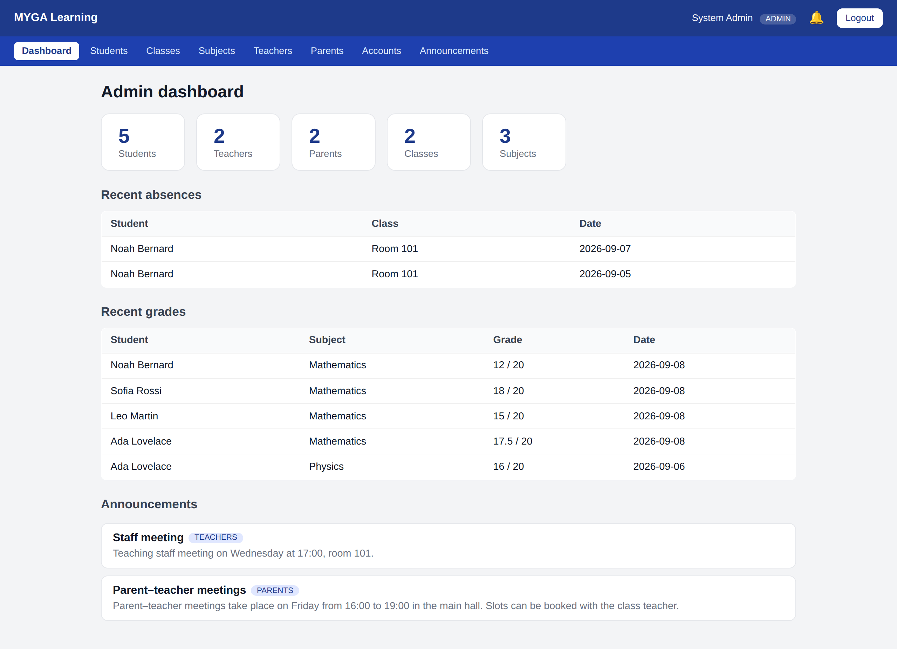 | 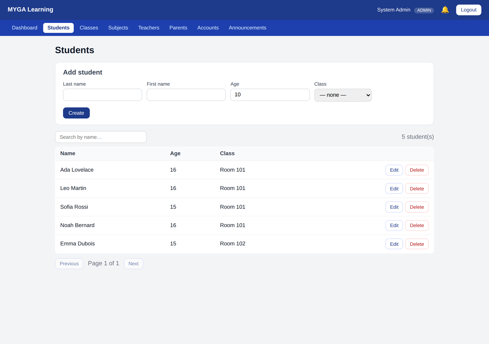 |
| **Dashboard** — live counts for the whole school plus recent activity, served by `GET /api/dashboard/admin`. | **Students** — server-side search and pagination; a student is an academic record, not a user. |
| 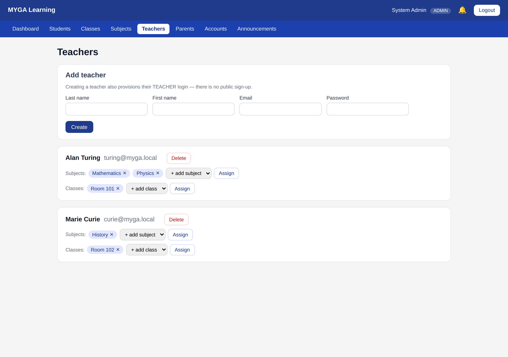 | 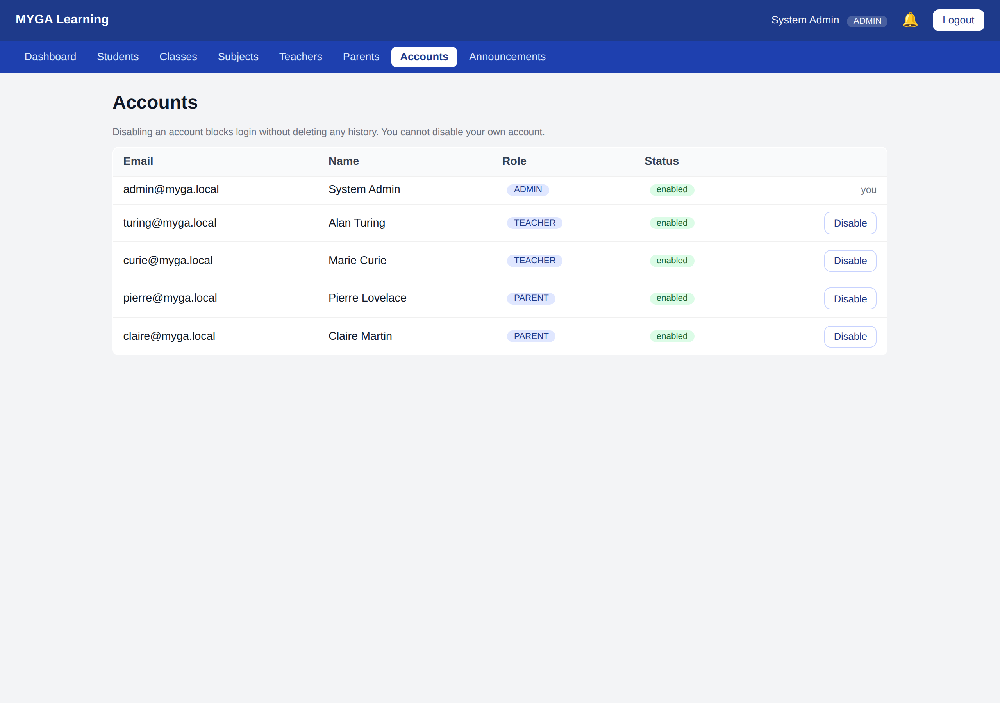 |
| **Teachers** — assign the subjects and classes a teacher is responsible for. Those assignments are what the backend later enforces. | **Accounts** — every login in the system, with its role, and a switch to disable an account without deleting it. |

### Teacher workspace

| | |
|---|---|
| 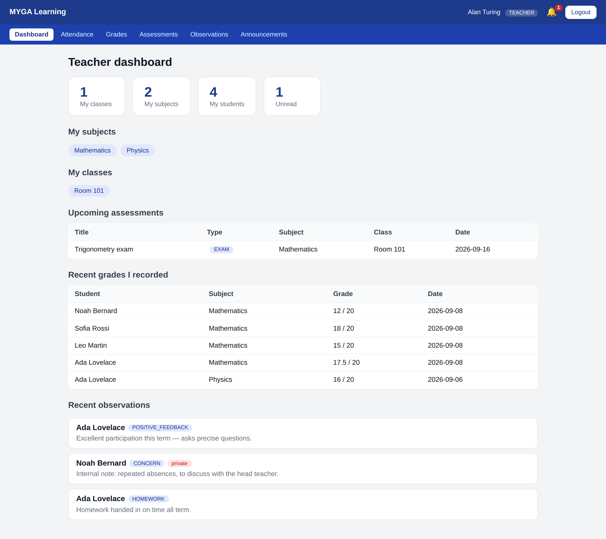 | 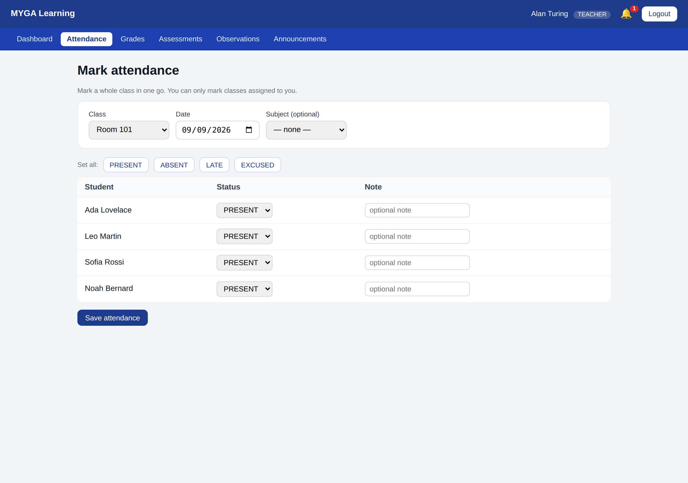 |
| **Dashboard** — only the teacher's own classes, subjects and students. | **Attendance** — mark a whole class in one request, with an optional note per student. |
| 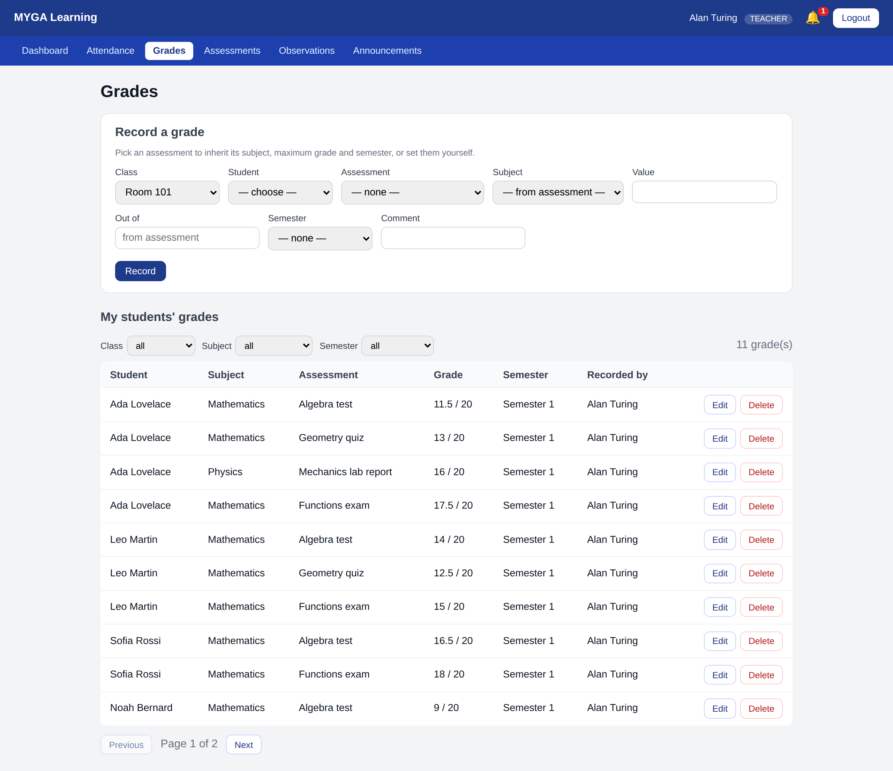 | 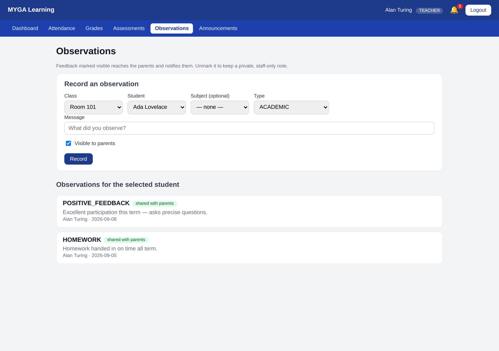 |
| **Grades** — record against an assessment (which supplies the subject, maximum and semester), then filter and page through them. A teacher may edit or delete only the grades they recorded. | **Observations** — feedback shared with parents, or a private staff-only note. Only the shared ones ever reach the parent portal. |

### Parent portal

| | |
|---|---|
| 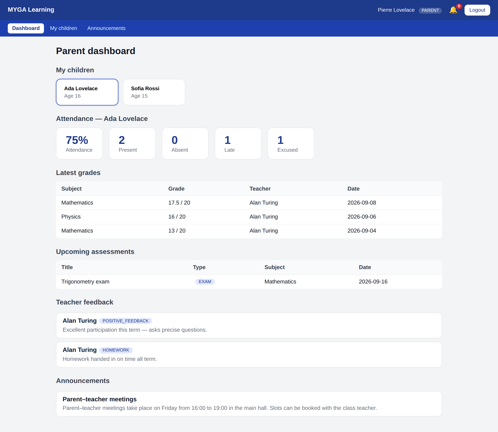 | 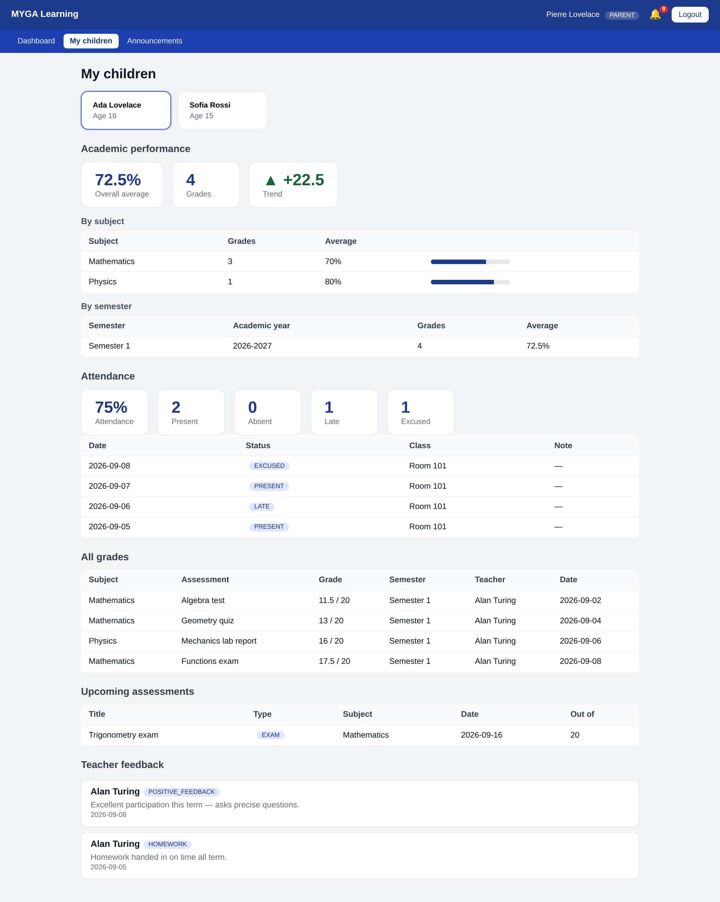 |
| **Dashboard** — a summary for the children linked to this parent, and nobody else's. | **Child detail** — averages by subject and semester, the term trend, the full attendance record, every grade, upcoming assessments and teacher feedback. |

### Communication

| | |
|---|---|
| 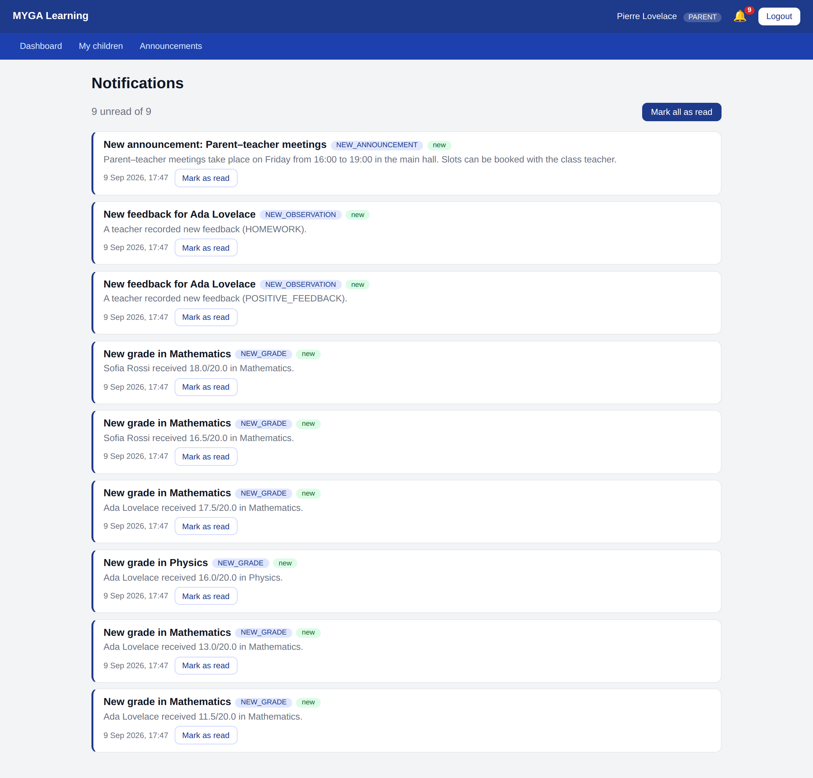 | 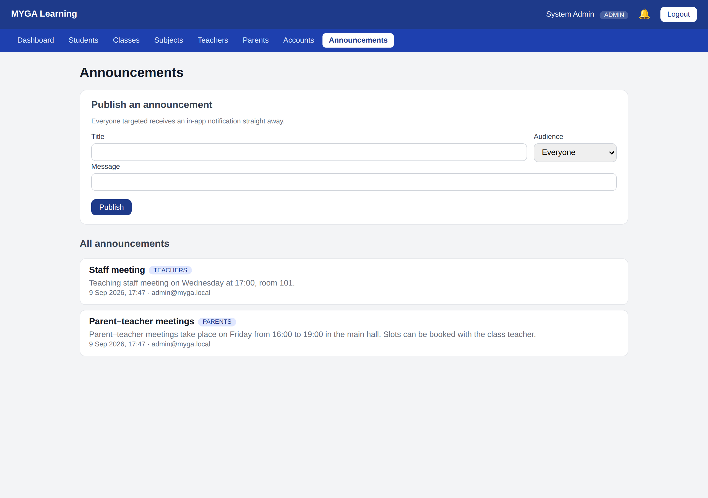 |
| **Notifications** — raised by real events (a new grade, an absence, shared feedback, an announcement), scoped to the signed-in user, with unread counts and mark-as-read. | **Announcements** — administrators publish to everyone, all parents, all teachers, a class or a single user; everyone targeted is notified. The composer is admin-only, and `GET /api/announcements` returns `403` to anyone else. |

## Future improvements

- **CI/CD** pipeline and containerised deployment.
- Database **migrations** (Flyway/Liquibase) instead of `ddl-auto`.
- Optional email/SMS/push notification channels.
- Refresh tokens.
- Upgrade to **Spring Boot 3 / Java 17+**.

## Project layout

```
myga_learning-main/
├── backend/        Spring Boot REST API (Java 11, Maven)
│   └── src/main/java/com/myga/learning/backend/backend/
│       ├── controller/   REST controllers
│       ├── service/      business logic + ownership rules
│       ├── repositories/ Spring Data JPA repositories
│       ├── models/       JPA entities + enums
│       ├── dto/          request/response DTOs
│       ├── mapper/       entity ⇄ DTO mappers
│       ├── security/     JWT filter, config, user details
│       ├── exception/    global error handling
│       └── config/       startup data (admin seed)
├── docs/           screenshots + the demo-data seeding script
└── frontend/       Angular 19 single-page app
    └── src/app/
        ├── core/     services, guards, interceptor, models
        ├── features/ login, dashboards, admin management, teacher workspace,
        │             parent portal, notifications, announcements
        └── shared/   layout shell
```
